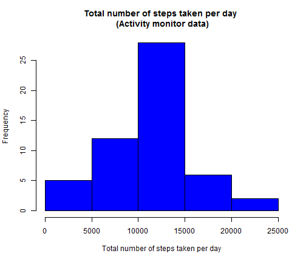
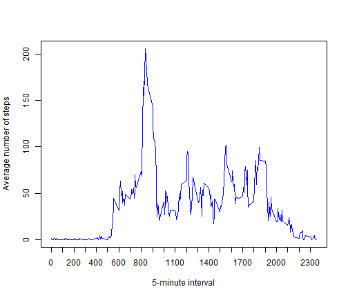
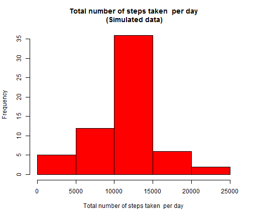
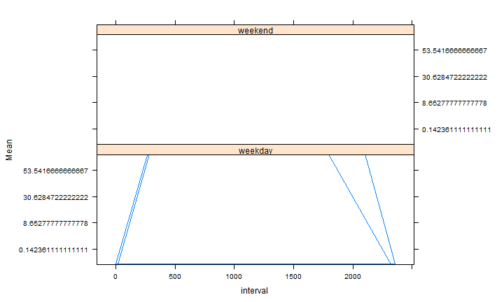

Report for the Peer Assignment 1 (Reproducible Research)
========================================================

### Loading and preprocessing the data

1.Loading data


```r
setwd("C:/Users/Pascal/Desktop/COURSEera/Data Science/Reproducible Research/project")
data<-read.csv("./prj1/activity.csv")
```

### Mean total number of steps taken per day

1.Histogram of the total number of steps taken each day    

*1a.Preprocessing the data*


```r
datamean<-subset(data,steps!="NA")
stepsum<-tapply(datamean[,1],datamean[,2],sum)
stepsumok<-subset(stepsum,stepsum!="NA")
stepsumokdf<-as.data.frame(stepsumok)
```

*1b.Histogram of the total number of steps taken each day*


```r
hist(stepsumokdf[,1],xlab="Total number of steps taken per day",col="blue", main="Total number of steps taken per day \n (Activity monitor data)")
```

 

2.Mean and median total number of steps taken per day  

*2a.Calculation*  


```r
stepmean<-mean(stepsumokdf[,1])
stepmedian<-median(stepsumokdf[,1])
```

*2b.Report*  

The mean total number of steps taken per day for the activity monitor data is:


```
## [1] 10766
```

The median total number of steps taken per day for the activity monitor data is: 


```
## [1] 10765
```

### The average daily activity pattern

1.Time series plot (i.e. type = "l") of the 5-minute interval (x-axis) and the average number of steps taken, averaged across all days (y-axis)  

Code for the preprocessing the data  


```r
step<-tapply(datamean[,1],datamean[,3],mean)
stepave<-as.data.frame(step)
stepave$Interval<-rownames(stepave)
```

Code for the plot


```r
plot(stepave[,2],stepave[,1],type="l",col="blue",xaxt="n",
     xlab="5-minute interval",ylab="Average number of steps")
axis(1,seq(0,2355,by=100))
```

 

2.The maximum number of steps  

*2a.Calulation*


```r
row<-which(stepave==max(stepave[,1]))
```

*2b.Report*    

On average across all the days in the dataset, the 5-minute interval that contains the maximum number of steps is 835.


### Imputing missing values

1.Missing values in the dataset


```r
t<-summary(data)
numberna<-t[[7]]
```

The total number of missing values in the dataset is


```
## [1] "NA's   :2304  "
```


2.Devise a strategy for filling in all of the missing values in the dataset.  

My strategy for filling  in all the missing values in the dataset is based on **the mean for each  5-minute interval**  


```r
newdata<-data
for (i in 1:nrow(stepave))
{stepave[i,2]
 for(j in 1:nrow(newdata))
 {
         if(is.na(newdata[j,1]) && newdata[j,3]== stepave[i,2])
         {newdata[j,1]<-stepave[i,1]}
       
         
 }
 
}
```

3.Creation of  a new dataset that is equal to the original dataset but with the missing data filled in.

The new dataset is "newdata". Here are some features of this dataset.


```r
str(newdata)
```

```
## 'data.frame':	17568 obs. of  3 variables:
##  $ steps   : num  1.717 0.3396 0.1321 0.1509 0.0755 ...
##  $ date    : Factor w/ 61 levels "2012-10-01","2012-10-02",..: 1 1 1 1 1 1 1 1 1 1 ...
##  $ interval: int  0 5 10 15 20 25 30 35 40 45 ...
```

```r
summary(newdata)
```

```
##      steps               date          interval   
##  Min.   :  0.0   2012-10-01:  288   Min.   :   0  
##  1st Qu.:  0.0   2012-10-02:  288   1st Qu.: 589  
##  Median :  0.0   2012-10-03:  288   Median :1178  
##  Mean   : 37.4   2012-10-04:  288   Mean   :1178  
##  3rd Qu.: 27.0   2012-10-05:  288   3rd Qu.:1766  
##  Max.   :806.0   2012-10-06:  288   Max.   :2355  
##                  (Other)   :15840
```

4.Histogram, mean and median of the total number of steps taken each day for the new dataset.   

*4a.Histogram of the total number of steps taken each day*  


```r
stepsumnew<-tapply(newdata[,1],newdata[,2],sum)
stepsumnewdf<-as.data.frame(stepsumnew)
stepsumnewdf$Index<-rownames(stepsumnewdf)
hist(stepsumnewdf[,1],xlab="Total number of steps taken  per day",col="red", main="Total number of steps taken  per day\n (Simulated data)")
```

 

*4b.Calculation of  the mean and median total number of steps taken per day*


```r
stepmeanew<-mean(stepsumnew)
stepmedianew<-median(stepsumnew)
```

*4c.Report of the mean and median total number of steps taken per day*  

The mean of the total number of steps taken per day for the new dataset is 

```
## [1] 10766
```

The median  of the total number of steps taken per day for the new dataset is:

```
## [1] 10766
```

*4d.Remarks*  

The means are the same for the estimates and the first part of the assignment. But the medians are different. The imputing  missing data on the estimates of the total daily number of steps change the **central tendency**. 

### Differences in activity patterns between weekdays and weekends

1.Creation of  a new factor variable in the dataset with two levels - "weekday" and "weekend" indicating whether a given date is a weekday or weekend. 


```r
newdata[,2]<-as.Date(newdata[,2])
newdata$DayType<-"test"

for(i in 1:nrow(newdata))
{
        if(weekdays(newdata[i,2])=="Sunday" || weekdays(newdata[i,2])=="Saturday")      
        {
                newdata[i,4]<-"weekend"
        }
        else
        {newdata[i,4]<-"weekday"
         
        }
        
}
newdata[,4]<-as.factor(newdata[,4])
str(newdata)
```

```
## 'data.frame':	17568 obs. of  4 variables:
##  $ steps   : num  1.717 0.3396 0.1321 0.1509 0.0755 ...
##  $ date    : Date, format: "2012-10-01" "2012-10-01" ...
##  $ interval: int  0 5 10 15 20 25 30 35 40 45 ...
##  $ DayType : Factor w/ 2 levels "weekday","weekend": 1 1 1 1 1 1 1 1 1 1 ...
```

2.Panel plot  containing a time series plot of the 5-minute interval (x-axis) and the average number of steps taken  (y-axis).

*2a.Preprocessing the data*


```r
stepnew<-tapply(newdata[,1],newdata[,2],mean)
stepnewdf<-as.data.frame(stepnew)
stepnewdf$Date<-rownames(stepnewdf)
newdata$Mean<-"mean"

for(i in 1:nrow(stepnewdf))
{
        for (j in 1:nrow(newdata))
        if(newdata[j,2]==stepnewdf[i,2])
        {
                newdata[j,5]<-stepnewdf[i,1]
        }
}
```

*2b.The panel plot with the lattice system*  
Code 


```r
library(lattice)
```

Plot
 

```r
xyplot(Mean~interval|DayType,data=newdata,type="l",layout=c(1,2))
```

 


